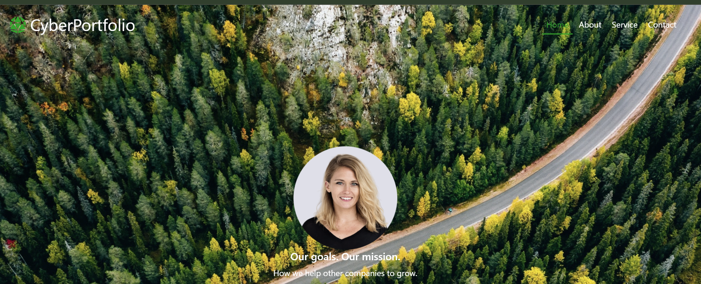
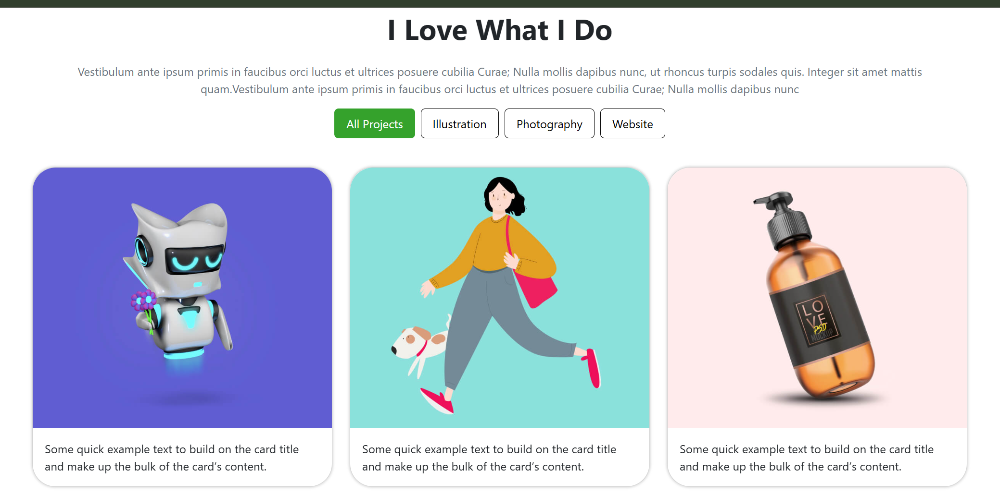
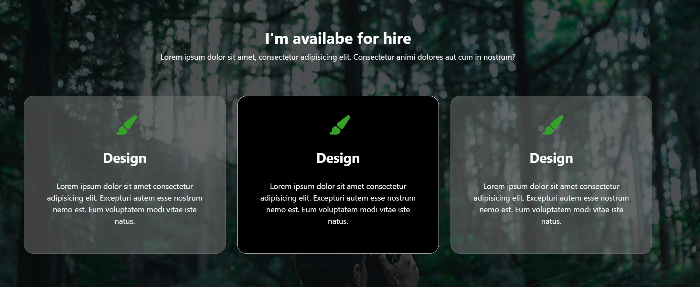
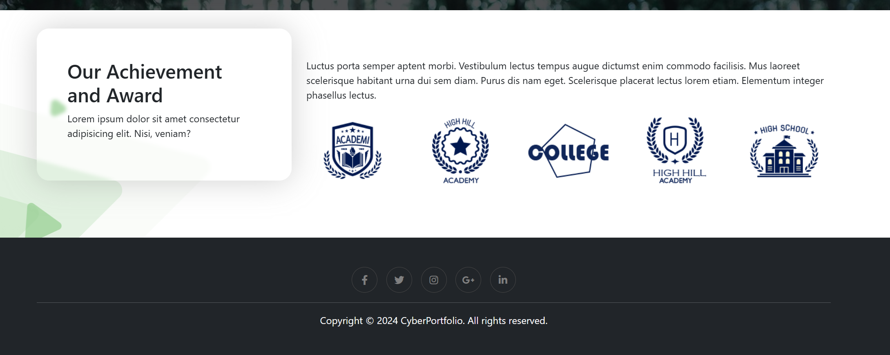

\# 🎨 HTML/CSS Practice - Sample Website

This project is a practice website built during my learning process.

\## 📚 Description

\- This is a sample UI website

\- Focus on layout, responsive design, and basic front-end skills

\- Not a real portfolio project

\## 🛠️ Technologies Used

\- HTML5

\- CSS3

\- Bootstrap 5

\## 📁 Project Structure

index.html

index.css

image/

\## 🎯 What I learned

\- Using Bootstrap Grid system

\- Responsive design with media queries

\- Positioning (relative, absolute)

\- Basic animations and UI styling

\## ▶️ How to run

Open `index.html` in your browser

\## 📌 Note

This project is for learning purposes only.

\## 📸 Screenshots

&#x20; 

&#x20; 

&#x20; 

&#x20; 

## 📬 Contact

Connect with me via:  
📧 **khanhvy0946265560@gmail.com**

---

© 2026 khanhvy0908

